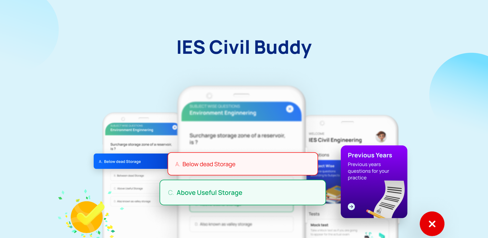

# IES ESE Civil

---

IES ESE Civil is an app which hepls the IES ESE Civil Examination aspirants practice question, provide notes and allow them to take mock test based on currated previous year questions.

📱 You can download the app from playstore from here: https://play.google.com/store/apps/details?id=com.upscrks.iesesecivil

## Features

---

- Practice questions on the go.
- Practice previous year's questions all at one stop.
- Intuitive User experience, learning with fun.
- Instant answers
- Handwritten notes
- Unlimited Time based Mock Tests
- Books references

## Screenshots

---

